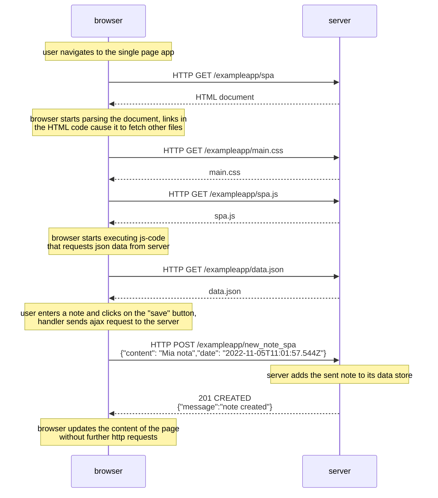

```mermaid
sequenceDiagram
    participant browser
    participant server
    Note over browser: user navigates to the single page app
    browser->>server: HTTP GET /exampleapp/spa
    server-->>browser: HTML document
    Note over browser: browser starts parsing the document, links in<br/>the HTML code cause it to fetch other files
    browser->>server: HTTP GET /exampleapp/main.css
    server-->>browser: main.css
    browser->>server: HTTP GET /exampleapp/spa.js
    server-->>browser: spa.js
    Note over browser: browser starts executing js-code<br/> that requests json data from server
    browser->>server: HTTP GET /exampleapp/data.json
    server-->>browser: data.json
    Note over browser: user enters a note and clicks on the "save" button,<br/>handler sends ajax request to the server
    browser->>server: HTTP POST /exampleapp/new_note_spa <br/>{"content": "Mia nota","date": "2022-11-05T11:01:57.544Z"}
    Note over server: server adds the sent note to its data store
    server-->>browser: 201 CREATED<br/>{"message":"note created"}
    Note over browser: browser updates the content of the page<br/> without further http requests
```
