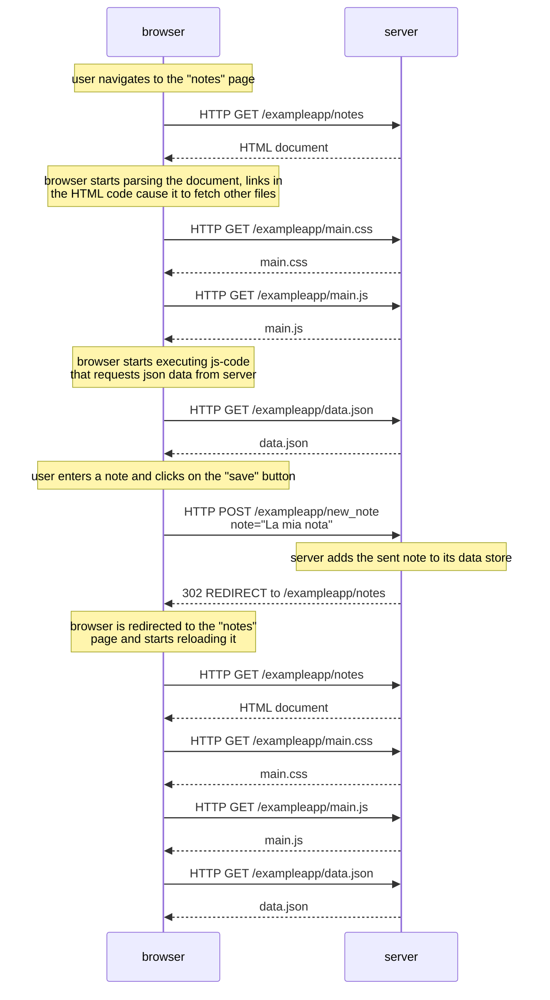

```mermaid
sequenceDiagram
    participant browser
    participant server
    Note over browser: user navigates to the "notes" page
    browser->>server: HTTP GET /exampleapp/notes
    server-->>browser: HTML document
    Note over browser: browser starts parsing the document, links in<br/>the HTML code cause it to fetch other files
    browser->>server: HTTP GET /exampleapp/main.css
    server-->>browser: main.css
    browser->>server: HTTP GET /exampleapp/main.js
    server-->>browser: main.js
    Note over browser: browser starts executing js-code<br/> that requests json data from server
    browser->>server: HTTP GET /exampleapp/data.json
    server-->>browser: data.json
    Note over browser: user enters a note and clicks on the "save" button
    browser->>server: HTTP POST /exampleapp/new_note <br/>note="La mia nota"
    Note over server: server adds the sent note to its data store
    server-->>browser: 302 REDIRECT to /exampleapp/notes
    Note over browser: browser is redirected to the "notes"<br/> page and starts reloading it
    browser->>server: HTTP GET /exampleapp/notes
    server-->>browser: HTML document
    browser->>server: HTTP GET /exampleapp/main.css
    server-->>browser: main.css
    browser->>server: HTTP GET /exampleapp/main.js
    server-->>browser: main.js
    browser->>server: HTTP GET /exampleapp/data.json
    server-->>browser: data.json
```